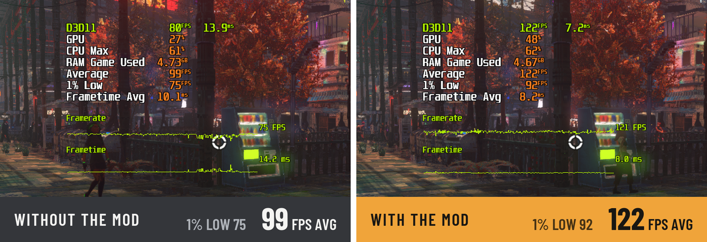
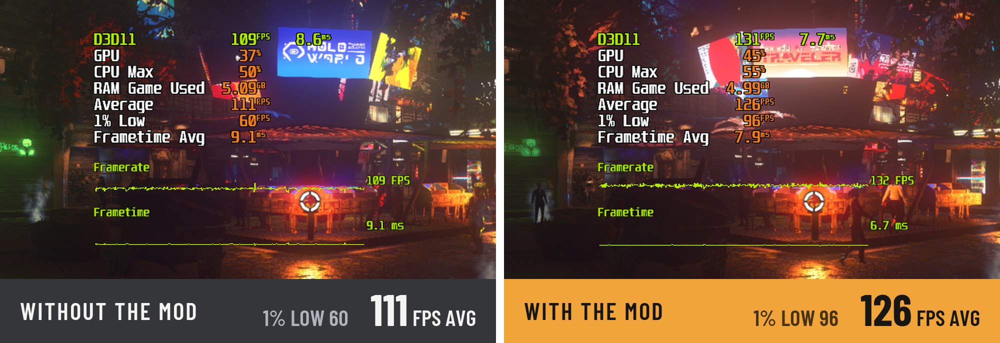
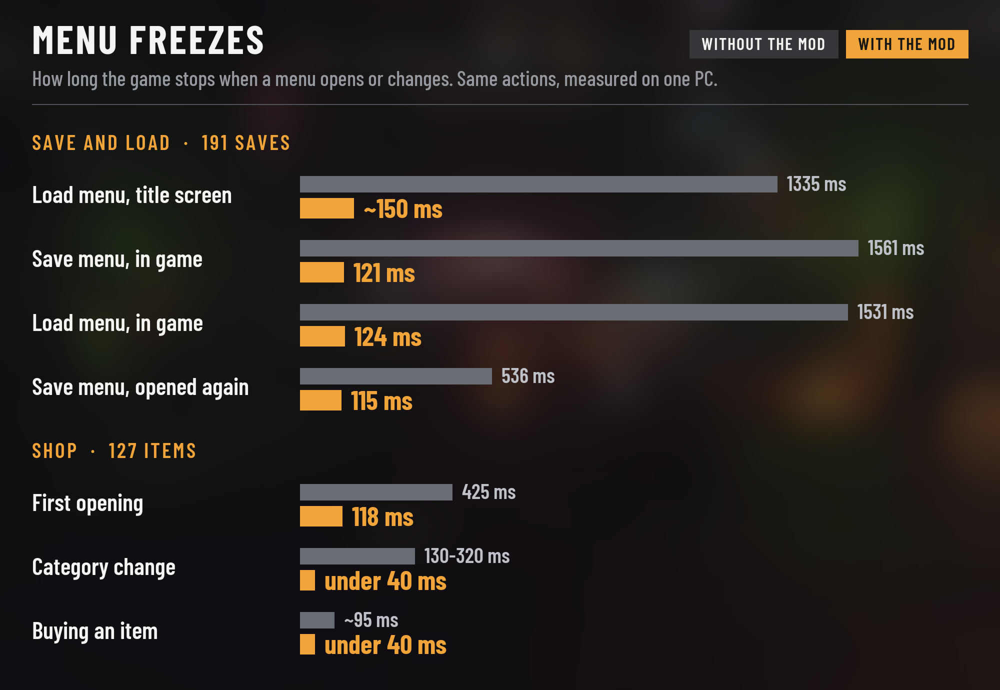

*[English version](README.md)*

Nivalis Nights peut ramer dans les endroits animés comme les marchés, et une grosse carte graphique n'y change pas
grand-chose : c'est le processeur qui limite le jeu. Ce mod BepInEx allège le travail du processeur là où ça ne se
voit pas.

Dans mes tests, un marché bondé est passé de 99 à 122 FPS en moyenne, et les saccades en ville ont presque
disparu. Les menus avec de longues listes (sauvegardes, boutiques) s'ouvrent sans figer le jeu, et le jeu ne plante
plus quand on le quitte. Les résultats dépendent de ton processeur et de l'endroit où tu es. L'affichage, le
gameplay et les sauvegardes ne changent pas.





Mesuré sur mon PC avec la mise à jour « Update #3 » du jeu. Pleine taille : marché
[sans](docs/images/full/market-off.jpg) / [avec](docs/images/full/market-on.jpg), Seaside Boardwalk
[sans](docs/images/full/seaside-off.jpg) / [avec](docs/images/full/seaside-on.jpg).

## Menus sans blocage

Avec beaucoup de sauvegardes ou une grande boutique, le jeu se figeait à chaque ouverture de liste, parce qu'il
reconstruisait toutes les lignes d'un coup. Le mod ne construit que les lignes visibles (les autres au fil du
défilement), prépare le reste en arrière-plan et saute la reconstruction quand rien n'a changé. Défilement, filtres,
recherche, tri et achats fonctionnent comme avant.



## Ce que le mod change

- **Threads de calcul.** Règle le nombre de threads du moteur selon ton processeur. Par défaut, le jeu perd du temps
  à réveiller trop de threads.
- **Personnages éloignés.** Les gens au loin ou hors écran mettent à jour leur animation moins souvent.
- **Détails des personnages éloignés.** Les gens hors écran ou au loin arrêtent de tourner la tête vers les autres
  et de bouger les lèvres, des détails invisibles à cette distance.
- **Menu pause.** Corrige un bug du jeu qui ré-animait chaque personnage éloigné à chaque image pendant la
  pause : environ +16 % de FPS dans le menu pause d'une zone chargée.
- **Caméra d'arrière-plan.** La caméra du ciel fait son rendu une image sur deux au lieu de chaque image.
- **Emploi du temps et trajets des PNJ.** Les PNJ replanifient leur journée et relisent leur chemin moins souvent.
- **Apparition des foules.** À chaque heure du jeu, les PNJ d'ambiance apparaissent tous dans la même seconde
  (saccades de 25 à 200 ms). Ils apparaissent maintenant sur quelques secondes.
- **Nettoyage de la mémoire.** Le nettoyage du jeu, qui fige le jeu 50 à 100 ms, passe moins souvent.
- **Moins de déchets en mémoire.** Plusieurs choses que le jeu fait à chaque image (vérification des tâches des PNJ,
  trajets, gestion des raccourcis clavier) ne créent plus de mémoire jetable, donc le nettoyage passe moins souvent.
- **Reflets de lumière (lens flares).** Le jeu vérifiait chaque reflet de la zone deux fois par image ; une suffit.
- **Menus Sauvegarder et Charger.** Avec 191 sauvegardes, ouvrir le menu Sauvegarder ou Charger figeait le jeu
  1,3 à 1,6 s (0,5 s à la réouverture). Maintenant environ 0,1 s : seules les sauvegardes visibles sont affichées,
  les autres au fil du défilement, et les images sont préparées en arrière-plan.
- **Boutiques.** Dans une boutique de 127 objets, la première ouverture figeait le jeu 0,4 s et chaque changement de
  catégorie 0,13 à 0,32 s. Maintenant 0,12 s et moins de 0,04 s : seuls les objets visibles sont affichés, et un
  clic sur un filtre reconstruit la liste une fois au lieu de deux. Filtres, recherche, tri et achats fonctionnent
  comme avant.
- **Plantage en quittant.** Le jeu plantait à chaque fermeture (un bug d'Unity, présent aussi sans aucun mod).
  Corrigé.
- **Tracked Quests HUD.** Si tu utilises le mod [Tracked Quests HUD](https://www.nexusmods.com/nivalisnights/mods/8) de Hvizeu, une saccade qu'il provoque quand
  aucune quête n'est épinglée est supprimée.

Chaque changement peut être désactivé dans la config.

## Installation

1. Installer [BepInEx 6 IL2CPP, build 788](https://builds.bepinex.dev/projects/bepinex_be/788/BepInEx-Unity.IL2CPP-win-x64-6.0.0-be.788%2B5b766a3.zip)
   (pas le BepInEx 5 classique) : l'extraire dans le dossier du jeu et lancer le jeu une fois.
2. Télécharger le mod sur [Nexus Mods](https://www.nexusmods.com/nivalisnights/mods/57) ou la
   [dernière version](https://github.com/hoho92/Nivalis-Performance-Fix/releases/latest) ici, et l'extraire
   dans le dossier du jeu, à côté de `Nivalis Nights.exe`.
3. Lancer le jeu, puis **le relancer une fois**. Le réglage des threads n'est lu qu'au démarrage.

Après une mise à jour du jeu ou une vérification des fichiers par Steam, le mod réapplique le réglage et redemande
une relance.

Pour vérifier que le mod tourne, la console BepInEx affiche `Nivalis Performance Fix 1.0.5: 14/14 optimizations active`
(15/15 avec Tracked Quests HUD).

## Configuration

`BepInEx/config/hoho92.nivalisperformancefix.cfg`, créé au premier lancement. Il contient un interrupteur général,
une section par changement, et `[JobWorkers] Mode` (`Auto`, `Manual` ou `Off` ; avec `Off`, le mod ne touche jamais
aux fichiers du jeu). Les valeurs par défaut sont celles qui ont le mieux marché. Avec
[Nivalis Config Manager](https://www.nexusmods.com/nivalisnights/mods/38), tu peux les changer en jeu (F1) ; elles
s'appliquent tout de suite, sauf le nombre de threads, qui demande une relance.

Un conseil qui n'a rien à voir avec le mod : une souris réglée à 2000 Hz ou plus coûte des FPS dans ce jeu quand tu
tournes la caméra. 1000 Hz suffit largement.

## Compatibilité

Testé avec [Nivalis Unofficial Patch](https://www.nexusmods.com/nivalisnights/mods/14),
[Nivalis Config Manager](https://www.nexusmods.com/nivalisnights/mods/38) et [Tracked Quests HUD](https://www.nexusmods.com/nivalisnights/mods/8) de Hvizeu : aucun
conflit, rien à régler. Unofficial Patch ralentit lui aussi l'animation des personnages éloignés ; avec les deux
installés, le réglage de ce mod prend le dessus.

## Si le jeu se met à jour

Si une mise à jour change le code que le mod modifie, la partie concernée se désactive toute seule et la console
indique laquelle. Le jeu continue de fonctionner normalement.

## Désinstallation

Supprimer `BepInEx/plugins/NivalisPerformanceFix`, puis lancer *Vérifier l'intégrité des fichiers du jeu* dans Steam
pour remettre le réglage d'origine des threads.

## Mises à jour

J'ai fait ce mod pour ma propre partie et je le partage au cas où il aiderait. Je le maintiens tant que je joue ;
quand j'arrêterai, les mises à jour risquent de s'arrêter aussi. Le code est sous licence MIT, donc n'importe qui peut
le reprendre.

## Pour les développeurs

Les changements viennent du profilage du jeu avec PIX et de la lecture du code désassemblé. La plupart sont des
patchs Harmony sur des méthodes du jeu (personnages, apparition des PNJ, reflets, fenêtres de sauvegarde, de
chargement et de boutique et leurs listes) ; les autres réécrivent quelques endroits du code natif, chacun retrouvé
par signature d'octets et vérifié avant d'être modifié : la fréquence du ramasse-miettes, les lectures d'emploi du
temps et de trajet des PNJ, les appels `Enum.HasFlag` du jeu, et un appel dans l'arrêt d'Unity (le plantage en
quittant). Les valeurs Unity lues à chaque image passent par un appel direct au code compilé, donc le mod lui-même
ne crée pas de déchets en mémoire.

Les outils de développement sont désactivés par défaut. Ils ont leur propre fichier,
`BepInEx/config/hoho92.nivalisperformancefix.dev.cfg` (`[Developer] Enabled = true`), pour ne pas apparaître dans les
menus de configuration en jeu :

- **F8** active ou désactive tout le mod, **F9** lance un banc A/B de `BenchTarget` (rester immobile dans un endroit
  animé), **F10** mesure les temps d'image pendant 20 s.
- Un journal écrit une ligne par minute et chaque saccade dans `BepInEx/NivalisPerformanceFix.playlog.log` ;
  **F11** marque une saccade ressentie. `python tools/analyze_playlog.py` le résume.

La compilation nécessite le SDK .NET 6 et le jeu avec BepInEx installé et lancé une fois :

```
dotnet build src/NivalisPerformanceFix -c Release -p:GameDir="C:\chemin\vers\Nivalis Nights"
```

Pour ne pas répéter le dossier, créer `GameDir.props` à la racine du dépôt (ignoré par git ; les outils Python le
lisent aussi, ou la variable d'environnement `NIVALIS_GAME_DIR`) :

```xml
<Project>
  <PropertyGroup>
    <GameDir Condition="'$(GameDir)' == ''">C:\chemin\vers\Nivalis Nights</GameDir>
  </PropertyGroup>
</Project>
```

Une compilation Release copie la DLL dans le jeu (`-p:InstallToGame=false` pour l'éviter). `tools/package.ps1` crée
l'archive de publication dans `dist/`.

## Licence

[MIT](LICENSE) © hoho92
