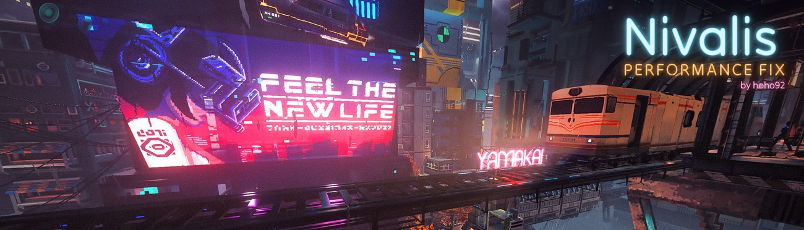

*[Version française](README.fr.md)*

Nivalis Nights can struggle in busy places like the markets, and a powerful graphics card doesn't help much: the
game is held back by the CPU. This BepInEx mod takes load off the CPU where you can't see the difference.

In my tests, a crowded market went from about 90 to about 118 FPS, and stutters while walking around town mostly
disappeared. Menus with long lists (saves, shops) open without freezing, and the game no longer crashes when you
quit. Results depend on your CPU and where you are. Visuals, gameplay and saves don't change.

## What it changes

- **Worker threads.** Sets the engine's worker thread count to suit your CPU. The game's default wastes time waking
  up too many threads.
- **Distant characters.** People far away or off-screen update their animation less often.
- **Far character details.** Characters off-screen or far away stop turning their head toward others and stop
  moving their lips, details nobody can see at that distance.
- **Pause menu.** Fixes a game bug that kept re-animating every far character each frame while the game is
  paused: about +16% FPS in the pause menu of a busy area.
- **Background camera.** The sky helper camera renders every few frames instead of every frame.
- **NPC schedules and paths.** NPCs re-plan their day and re-read their path less often.
- **Crowds appearing.** Every in-game hour, the game spawns its background NPCs all within one second (hitches of
  25 to 200 ms). They now appear over a few seconds instead.
- **Memory cleanup.** The game's cleanup pass, which freezes the game for 50 to 100 ms, runs less often.
- **Less garbage.** Several things the game does every frame (NPC task checks, navigation paths, the keyboard
  shortcut handler) no longer create throwaway memory, so the cleanup pass is needed less often.
- **Lens flares.** The game checked every lens flare of the area twice per frame; once is enough.
- **Save and Load menus.** With 191 saves, opening the Save or Load menu froze the game for 1.3 to 1.6 s (0.5 s when
  reopening). Now about 0.1 s: only the visible saves are drawn, the rest as you scroll, and the screenshots are
  prepared in the background.
- **Shops.** In a shop with 127 items, the first opening froze for 0.4 s and every category change for 0.13 to
  0.32 s. Now 0.12 s and under 0.04 s: only the visible items are drawn, and a filter click rebuilds the list once
  instead of twice. Filters, search, sorting and buying work as before.
- **Crash when quitting.** The game crashed every time you quit (a Unity bug, also without any mod). Fixed.
- **Tracked Quests HUD.** If you use Hvizeu's [Tracked Quests HUD](https://www.nexusmods.com/nivalisnights/mods/8), a hitch it causes when no quest is pinned is
  removed.

Each one can be turned off in the config.

## Install

1. Install [BepInEx 6 IL2CPP, build 788](https://builds.bepinex.dev/projects/bepinex_be/788/BepInEx-Unity.IL2CPP-win-x64-6.0.0-be.788%2B5b766a3.zip)
   (not the regular BepInEx 5): extract it into the game folder and launch the game once.
2. Download the mod from [Nexus Mods](https://www.nexusmods.com/nivalisnights/mods/57) or the
   [latest release](https://github.com/hoho92/Nivalis-Performance-Fix/releases/latest) here, and extract it
   into the game folder, next to `Nivalis Nights.exe`.
3. Launch the game, then **restart it once**. The thread setting is only read when the game starts.

After a game update or a Steam file check, the mod applies the thread setting again and asks for one more restart.

To check it's running, the BepInEx console shows `Nivalis Performance Fix 1.0.5: 14/14 optimizations active`
(15/15 with Tracked Quests HUD).

## Configuration

`BepInEx/config/hoho92.nivalisperformancefix.cfg`, created on first launch. There is a master switch, one section
per change, and `[JobWorkers] Mode` (`Auto`, `Manual` or `Off`, where `Off` never touches the game files). The
defaults are the settings that worked best. With [Nivalis Config Manager](https://www.nexusmods.com/nivalisnights/mods/38)
you can change them in game (F1); they apply right away, except the thread count, which needs a restart.

One tip unrelated to the mod: a mouse polling at 2000 Hz or more costs FPS in this game when you turn the camera.
1000 Hz is plenty.

## Compatibility

Tested together with [Nivalis Unofficial Patch](https://www.nexusmods.com/nivalisnights/mods/14),
[Nivalis Config Manager](https://www.nexusmods.com/nivalisnights/mods/38) and Hvizeu's [Tracked Quests HUD](https://www.nexusmods.com/nivalisnights/mods/8): no
conflict, nothing to configure. Unofficial Patch also slows down distant characters' animation; with both installed,
this mod's setting takes over.

## If the game updates

If an update changes the code the mod patches, that part turns itself off and the console names it. The game keeps
running normally.

## Uninstall

Delete `BepInEx/plugins/NivalisPerformanceFix`, then run Steam's *Verify integrity of game files* to restore the
original thread setting.

## About updates

I made this for my own playthrough and I'm sharing it in case it helps. I'll keep it working while I'm playing; once
I stop, updates may stop too. The code is MIT-licensed, so anyone is welcome to pick it up.

## For developers

The changes come from profiling the game with PIX and reading the disassembly. Most are Harmony patches on game
methods (characters, NPC spawns, lens flares, the save, load and shop windows and their lists); the others rewrite a
few spots of native code, each found by byte signature and checked before it is changed: the garbage collector's
frequency, NPC schedule and path reads, the game's `Enum.HasFlag` calls, and one call in Unity's shutdown (the
crash on quit). Per-frame reads of Unity values call the compiled methods directly, so the mod itself creates no
garbage.

Developer tools are off by default. They live in their own file, `BepInEx/config/hoho92.nivalisperformancefix.dev.cfg`
(`[Developer] Enabled = true`), so they don't show up in in-game config menus:

- **F8** toggles the whole mod, **F9** runs an A/B benchmark of `BenchTarget` (stand still somewhere busy), **F10**
  measures frame times for 20 s.
- A play log writes one line per minute plus every hitch to `BepInEx/NivalisPerformanceFix.playlog.log`; **F11**
  marks a hitch you felt. `python tools/analyze_playlog.py` summarises it.

Building needs the .NET 6 SDK and the game with BepInEx installed and run once:

```
dotnet build src/NivalisPerformanceFix -c Release -p:GameDir="C:\path\to\Nivalis Nights"
```

To avoid passing the folder each time, create `GameDir.props` at the repository root (ignored by git; the Python
tools read it too, or the `NIVALIS_GAME_DIR` environment variable):

```xml
<Project>
  <PropertyGroup>
    <GameDir Condition="'$(GameDir)' == ''">C:\path\to\Nivalis Nights</GameDir>
  </PropertyGroup>
</Project>
```

A Release build copies the DLL into the game (`-p:InstallToGame=false` to skip). `tools/package.ps1` builds the
release zip into `dist/`.

## License

[MIT](LICENSE) © hoho92
